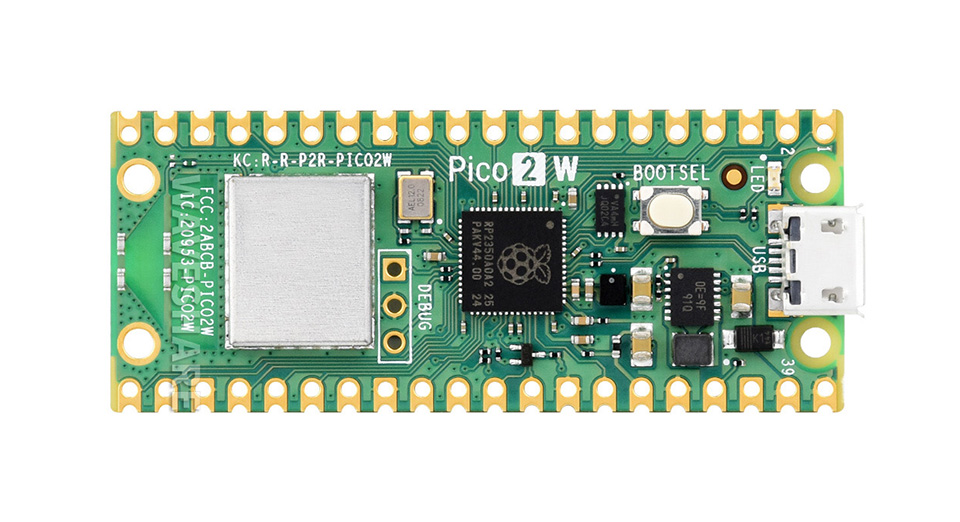
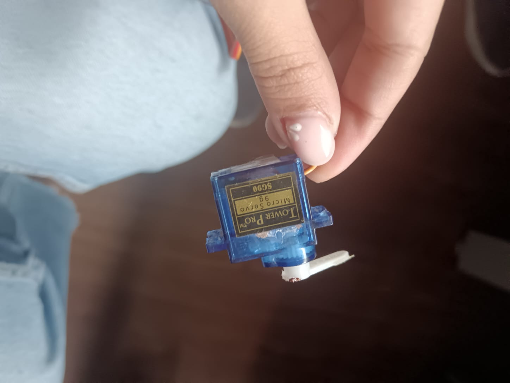

# Taller2-comunicaciones-industriales
## integrantes: camila perez, santiago hernandez, diego alejandro rodriguez.
## Primer punto 
PROFIBUS (PROcess Fleld Bus): Se determina como un Bus de campo serial direccionado principalmente a la automatización industrial.  

-> Topologia: Su topologia es de bus multipunto con terminación en extremos.  

-> Ventajas: Buen control ciclico, es ampliamente utilizado en PLCs y tambien en sensores industriales.  

-> Capa: Fisica y de enlace  

-> Casos de uso: Comunicaciones entre E/S remotas, comunicaciones entre PLCs y módulos en plantas industriales.  

PROFINET: Se determina como ethernet industrial definido por PROFIBUS y PROFINET, sobre un módelo de Ethernet estandar pero con perfiles para tiempo real, además de que su velocidad tipica se encuentra entre 100Mbps.   

-> Topologia: De por si entre lsa topologias comunes se encuentra la de estrella y anillo.  

-> Ventajas: Se caracteriza por tener alta velocidad, soporte de servicios, integración sencilla con redes IT y tambien diagnosticos avanzados.  

-> Capa: Capa fisica basada en ethernet.  

-> Casos de uso: Se suele utilizar para el control de fábricas modernas, sistemas que necesitan mucho ancho de banda y HMI/SCADA.  

-> Desventajas: Requiere switches y por lo tanto, suele tener mayor complejidad en la configuración.   

## Segundo punto:   

Para el segundo punto se utilizo una raspberry pi pico 2w y un servo motor.

En esta actividad se desarrolló un sistema de control para un servo motor SG90 utilizando una Raspberry Pi Pico 2W conectada a través de un módulo MAX485 para comunicación industrial mediante RS-485. El objetivo fue demostrar los tres modos de comunicación (Simplex, Half Dúplex y Full Dúplex) y observar cómo afectan el intercambio de información entre dispositivos.

 Descripción general del código

El programa fue desarrollado en MicroPython, aprovechando las librerías machine, utime y _thread para manejar los periféricos y la multitarea del microcontrolador.
El archivo principal contiene la clase ServoControlPico, encargada de inicializar el hardware, configurar la UART y controlar el servo por medio de señales PWM.

Principales configuraciones:

UART RS-485:

TX → GPIO0

RX → GPIO1

DE → GPIO2 (Driver Enable)

RE → GPIO3 (Receiver Enable)

Velocidad de comunicación: 9600 baudios

Servo PWM:

GPIO4 como salida PWM a 50 Hz

Rango de 0° a 180° con conversión a ciclo útil entre 0.5 ms y 2.5 ms

---

 Esquema de conexión

Raspberry Pi Pico 2W → Módulo MAX485

GPIO0 → DI  
GPIO1 → RO  
GPIO2 → DE  
GPIO3 → RE  
3.3V  → VCC  
GND   → GND

MAX485 → Bus RS-485

A → A  
B → B

Raspberry Pi Pico 2W → Servo SG90

GPIO4 → Señal (naranja)  
5V    → VCC (rojo)  
GND   → GND (marrón)

> Se añadieron resistencias de 120 Ω en los extremos del bus y un capacitor de 100 nF entre VCC y GND del módulo MAX485 para estabilidad eléctrica.

 Funcionamiento por modos

El código implementa tres modos de comunicación que pueden ejecutarse desde el menú principal o mediante las funciones de demostración:

1. Modo Simplex

Solo se transmite información del maestro hacia el esclavo.

La función demo_simplex() envía una secuencia de comandos que cambian el ángulo del servo (0°, 45°, 90°, 135°, 180°…).

El sistema usa set_transmit_mode() para mantener DE y RE en nivel alto (solo transmisión).

Ideal para pruebas donde solo se necesita enviar datos.

2. Modo Half Dúplex

En este modo la comunicación se alterna entre transmisión y recepción.

Primero se activa set_transmit_mode() para enviar el comando con el ángulo (SET:valor), luego se cambia a set_receive_mode() para escuchar una confirmación o respuesta.

Se utiliza la función demo_half_duplex(), donde se envía un nuevo ángulo y se espera la confirmación con receive_data().

Es el modo más usado en RS-485, ya que aprovecha una sola línea para ambos sentidos, alternando los estados de DE y RE.

3. Modo Full Dúplex

Se realiza transmisión y recepción simultáneamente (requiere dos módulos RS-485 o dos Picos).

La función demo_full_duplex() crea un hilo secundario con _thread.start_new_thread() que ejecuta continuous_receiver(), permitiendo recibir datos en paralelo mientras se transmiten comandos.

Cada mensaje enviado con formato POS:valor es respondido con ACK:valor, validando la comunicación en ambos sentidos.

 Flujo del programa principal

Al ejecutar el script, se muestra un menú que permite seleccionar entre control manual o demostraciones automáticas.
Por ejemplo, al elegir la opción “Demo Completa”, se ejecuta la secuencia:

1. demo_simplex()

2. demo_half_duplex()

3. demo_full_duplex()

Durante la ejecución, el sistema reporta el número de mensajes enviados (TX), recibidos (RX), el modo actual, y la posición del servo.
Al finalizar, se llama a cleanup() para detener el PWM y dejar el servo en posición central.

 Resultado esperado

En Simplex, el servo se mueve siguiendo una secuencia sin recibir respuesta.

En Half Dúplex, el sistema envía un comando y espera confirmación del otro extremo antes de continuar.

En Full Dúplex, se observan transmisiones y recepciones simultáneas, demostrando comunicación bidireccional continua.

Codigos utilizados:  

import machine
import utime
import _thread
from micropython import const

# Configuración de pines para Pico 2W
UART_TX_PIN = const(0)    # GPIO0 - TX
UART_RX_PIN = const(1)    # GPIO1 - RX 
DE_PIN = const(2)         # GPIO2 - Driver Enable
RE_PIN = const(3)         # GPIO3 - Receiver Enable
SERVO_PIN = const(4)      # GPIO4 - Servo PWM

# Configuración UART RS-485
UART_BAUDRATE = const(9600)
UART_ID = const(0)

class ServoControlPico:
    def _init_(self):
        # Estado del sistema
        self.running = True
        self.servo_position = 90  # Posición inicial
        self.mode = "HALF_DUPLEX"
        
        # Estadísticas
        self.commands_sent = 0
        self.commands_received = 0
        
        # Inicializar hardware
        self.setup_pins()
        self.setup_uart()
        self.setup_servo()
        
        print("Sistema Servo RS-485 Pico 2W Inicializado")
        self.show_status()
    
    def setup_pins(self):
        """Configuración de pines GPIO"""
        # Pines control RS-485
        self.de_pin = machine.Pin(DE_PIN, machine.Pin.OUT)
        self.re_pin = machine.Pin(RE_PIN, machine.Pin.OUT)
        
        # Inicialmente en modo recepción
        self.set_receive_mode()
    
    def setup_uart(self):
        """Configuración UART para RS-485"""
        try:
            self.uart = machine.UART(
                UART_ID,
                baudrate=UART_BAUDRATE,
                tx=machine.Pin(UART_TX_PIN),
                rx=machine.Pin(UART_RX_PIN),
                bits=8,
                parity=None,
                stop=1
            )
            print(f"UART RS-485 inicializado a {UART_BAUDRATE} baudios")
        except Exception as e:
            print(f"Error UART: {e}")
    
    def setup_servo(self):
        """Configuración del servo motor"""
        self.servo = machine.PWM(machine.Pin(SERVO_PIN))
        self.servo.freq(50)  # 50Hz para servo
        self.set_servo_angle(90)  # Posición central
    
    def set_servo_angle(self, angle):
        """Controla el servo (0-180 grados)"""
        if 0 <= angle <= 180:
            # Convertir ángulo a duty cycle (0.5ms - 2.5ms)
            min_duty = 1638  # 0.5ms / 20ms * 65535
            max_duty = 8192  # 2.5ms / 20ms * 65535
            duty = int(min_duty + (angle / 180) * (max_duty - min_duty))
            
            self.servo.duty_u16(duty)
            self.servo_position = angle
            print(f"Servo: {angle}°")
            return True
        return False
    
    def set_transmit_mode(self):
        """Modo transmisión RS-485"""
        self.de_pin.value(1)  # HIGH
        self.re_pin.value(1)  # HIGH
        utime.sleep_ms(1)     # Estabilizar
    
    def set_receive_mode(self):
        """Modo recepción RS-485"""
        self.de_pin.value(0)  # LOW
        self.re_pin.value(0)  # LOW
        utime.sleep_ms(1)     # Estabilizar
    
    def send_command(self, command):
        """Envía comando según modo actual"""
        if not self.uart:
            return False
            
        try:
            data = f"{command}\n"
            
            if self.mode == "SIMPLEX":
                # Simplex: siempre transmitir
                self.set_transmit_mode()
                self.uart.write(data)
                
            elif self.mode == "HALF_DUPLEX":
                # Half Duplex: transmitir luego recibir
                self.set_transmit_mode()
                self.uart.write(data)
                utime.sleep_ms(10)
                self.set_receive_mode()
                
            elif self.mode == "FULL_DUPLEX":
                # Full Duplex: transmitir mientras se recibe
                self.set_transmit_mode()
                self.uart.write(data)
                # RE permanece en HIGH para transmisión continua
                
            self.commands_sent += 1
            print(f"[TX {self.mode}] {command}")
            return True
            
        except Exception as e:
            print(f"Error TX: {e}")
            return False
    
    def receive_data(self, timeout_ms=100):
        """Recibe datos con timeout"""
        if not self.uart:
            return None
            
        start_time = utime.ticks_ms()
        
        while utime.ticks_diff(utime.ticks_ms(), start_time) < timeout_ms:
            if self.uart.any():
                try:
                    data = self.uart.readline()
                    if data:
                        message = data.decode('utf-8').strip()
                        self.commands_received += 1
                        print(f"[RX {self.mode}] {message}")
                        return message
                except Exception as e:
                    print(f"Error RX: {e}")
            utime.sleep_ms(10)
        
        return None
    
    def continuous_receiver(self):
        """Recepción continua para Full Duplex"""
        print("Iniciando recepción continua...")
        while self.running and self.mode == "FULL_DUPLEX":
            data = self.receive_data(50)
            if data:
                self.process_command(data)
            utime.sleep_ms(10)
    
    def process_command(self, command):
        """Procesa comandos recibidos"""
        if command.startswith("POS:"):
            try:
                angle = int(command[4:])
                if self.set_servo_angle(angle):
                    if self.mode == "FULL_DUPLEX":
                        self.send_command(f"ACK:{angle}")
            except ValueError:
                print("Error: Ángulo inválido")
        
        elif command == "STATUS":
            self.send_command(f"STATUS:{self.servo_position}")
        
        elif command == "PING":
            self.send_command("PONG")
    
    def demo_simplex(self):
        """Demostración modo Simplex"""
        print("\n=== MODO SIMPLEX ===")
        self.mode = "SIMPLEX"
        self.set_transmit_mode()  # Permanente transmisión
        
        angles = [0, 45, 90, 135, 180, 90, 0]
        
        for angle in angles:
            if not self.running:
                break
                
            self.set_servo_angle(angle)
            self.send_command(f"MOV:{angle}")
            utime.sleep(2)
        
        self.set_receive_mode()
        print("Demo Simplex completada")
    
    def demo_half_duplex(self):
        """Demostración modo Half Duplex"""
        print("\n=== MODO HALF DUPLEX ===")
        self.mode = "HALF_DUPLEX"
        
        angles = [0, 60, 120, 180, 90, 30]
        
        for angle in angles:
            if not self.running:
                break
                
            # Transmitir posición
            self.set_servo_angle(angle)
            self.send_command(f"SET:{angle}")
            
            # Esperar y recibir confirmación
            utime.sleep_ms(500)
            response = self.receive_data(1000)
            
            if response:
                print(f"Confirmación: {response}")
            
            utime.sleep(1)
        
        print("Demo Half Duplex completada")
    
    def demo_full_duplex(self):
        """Demostración modo Full Duplex"""
        print("\n=== MODO FULL DUPLEX ===")
        self.mode = "FULL_DUPLEX"
        
        # Iniciar recepción en segundo plano
        receiver_thread = _thread.start_new_thread(self.continuous_receiver, ())
        
        angles = [0, 30, 60, 90, 120, 150, 180, 90, 0]
        
        for angle in angles:
            if not self.running:
                break
                
            self.set_servo_angle(angle)
            self.send_command(f"POS:{angle}")
            utime.sleep(1.5)
        
        # Dar tiempo para respuestas finales
        utime.sleep(2)
        self.mode = "HALF_DUPLEX"  # Volver a modo normal
        print("Demo Full Duplex completada")
    
    def manual_control(self):
        """Control manual desde terminal"""
        print("\n=== CONTROL MANUAL ===")
        print("Comandos: 0-180 (ángulo), mode, status, quit")
        
        while self.running:
            try:
                command = input("Comando: ").strip()
                
                if command == "quit":
                    break
                elif command == "status":
                    self.show_status()
                elif command == "mode":
                    self.select_mode()
                else:
                    # Intentar como ángulo
                    angle = int(command)
                    if self.set_servo_angle(angle):
                        self.send_command(f"MANUAL:{angle}")
                        
            except ValueError:
                print("Comando inválido")
            except KeyboardInterrupt:
                break
    
    def select_mode(self):
        """Selección de modo de comunicación"""
        print("\n--- Seleccionar Modo ---")
        print("1. Simplex")
        print("2. Half Duplex")
        print("3. Full Duplex")
        
        choice = input("Modo (1-3): ").strip()
        
        if choice == "1":
            self.mode = "SIMPLEX"
        elif choice == "2":
            self.mode = "HALF_DUPLEX"
        elif choice == "3":
            self.mode = "FULL_DUPLEX"
        else:
            print("Modo no cambiado")
        
        print(f"Modo actual: {self.mode}")
    
    def show_status(self):
        """Muestra estado del sistema"""
        print(f"\n=== ESTADO PICO 2W ===")
        print(f"Modo: {self.mode}")
        print(f"Servo: {self.servo_position}°")
        print(f"TX: {self.commands_sent}, RX: {self.commands_received}")
        print(f"DE: {self.de_pin.value()}, RE: {self.re_pin.value()}")
        print("======================")
    
    def run_demo_sequence(self):
        """Ejecuta demostración completa"""
        print("Iniciando demostración completa...")
        
        self.demo_simplex()
        utime.sleep(2)
        
        self.demo_half_duplex() 
        utime.sleep(2)
        
        self.demo_full_duplex()
        
        print("\nDemostración completada!")
        self.show_status()
    
    def cleanup(self):
        """Limpieza de recursos"""
        print("Limpiando recursos...")
        self.running = False
        self.servo.deinit()
        self.set_servo_angle(90)  # Posición central
        utime.sleep(1)

def main():
    """Función principal"""
    system = None
    
    try:
        system = ServoControlPico()
        
        while system.running:
            print("\n--- MENÚ PRINCIPAL ---")
            print("1. Control Manual")
            print("2. Demo Simplex")
            print("3. Demo Half Duplex") 
            print("4. Demo Full Duplex")
            print("5. Demo Completa")
            print("6. Estado del Sistema")
            print("7. Salir")
            
            try:
                option = input("Opción: ").strip()
                
                if option == "1":
                    system.manual_control()
                elif option == "2":
                    system.demo_simplex()
                elif option == "3":
                    system.demo_half_duplex()
                elif option == "4":
                    system.demo_full_duplex()
                elif option == "5":
                    system.run_demo_sequence()
                elif option == "6":
                    system.show_status()
                elif option == "7":
                    break
                else:
                    print("Opción inválida")
                    
            except KeyboardInterrupt:
                print("\nInterrumpido por usuario")
                break
            except Exception as e:
                print(f"Error: {e}")
                
    except Exception as e:
        print(f"Error inicial: {e}")
    finally:
        if system:
            system.cleanup()
        print("Sistema terminado")

if _name_ == "_main_":
    main()

Este código demuestra el principio de operación del estándar RS-485 en sistemas industriales, aplicando conceptos de comunicación serial diferencial, control de flujo, sincronización y direccionamiento, todo implementado en un entorno embebido real con Raspberry Pi Pico 2W.

## configuracion Rs-485:   

Configuración para Raspberry Pi Pico 2W - RS-485

# Pines GPIO
PINS = {
    'uart_tx': 0,      # GPIO0 - TX
    'uart_rx': 1,      # GPIO1 - RX  
    'de': 2,           # GPIO2 - Driver Enable
    're': 3,           # GPIO3 - Receiver Enable
    'servo': 4,        # GPIO4 - Servo PWM
    'led': 25          # GPIO25 - LED interno
}

# Configuración UART
UART_CONFIG = {
    'id': 0,
    'baudrate': 9600,
    'bits': 8,
    'parity': None,
    'stop': 1
}

# Configuración Servo
SERVO_CONFIG = {
    'min_angle': 0,
    'max_angle': 180,
    'pwm_freq': 50,
    'min_duty': 1638,   # 0.5ms
    'max_duty': 8192    # 2.5ms
}

# Modos de operación
MODES = {
    'SIMPLEX': {
        'de': 1,
        're': 1,
        'desc': 'Solo transmisión'
    },
    'HALF_DUPLEX': {
        'de': 'alternate', 
        're': 'alternate',
        'desc': 'TX/RX alternados'
    },
    'FULL_DUPLEX': {
        'de': 1,
        're': 0, 
        'desc': 'TX/RX simultáneos'
    }
}

